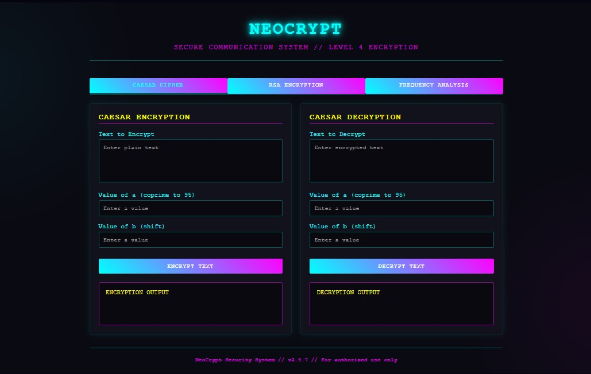

# 🔐 NeoCrypt - Secure Communication System

A futuristic encryption/decryption toolkit with a dystopian cyberpunk aesthetic. NeoCrypt provides military-grade cryptographic algorithms through an immersive web interface that evokes the feeling of a high-tech cyberpunk world.

---

## 🧠 Features

- 🧪 **Caesar Cipher (Affine variant)**  
  - Supports custom coprime (a) and shift (b)
  - Saves encrypted and decrypted files

- 🔎 **Frequency Analysis Decryption**  
  - Break Caesar Cipher without key using English letter frequency

- 🔐 **RSA Encryption**  
  - Random prime-based key generation
  - Saves and reads encrypted output to/from files

- 🌐 Futuristic Web Interface
  - Cyberpunk-inspired design with neon accents
  - Responsive layout with tab-based navigation
  - Interactive simulation of cryptographic operations

- 🧾 **File Persistence**  
  - Automatically reads from and writes to files
  - Modular design with clear separation of concerns

---

## 💻 Technologies Used

- **Frontend:** HTML5, CSS3, JavaScript
- **Backend:** C++ (with potential for WebAssembly integration):** C++
- **Design:** Cyberpunk aesthetic with CSS animations and gradients
- **Libraries:** Standard C++ libraries (iostream, fstream, vector, map, ctime)

---

## 📂 File Structure

| Folder       | Contents                                   |
|--------------|--------------------------------------------|
| `frontend/`  | HTML/CSS/JS web interface files            |
| `backend/`   | C++ encryption/decryption source code      |
| `docs/`      | Documentation and screenshots              |

---

## 🚀 How to Use

### Web Interface (Current)
1. Open `index.html` in any modern web browser
2. Navigate between tabs for different encryption methods
3. Enter your text and parameters
4. Click encrypt/decrypt buttons to see results

### C++ Backend (Original)
1. Compile the C++ code with any C++ compiler:
    ```bash
    g++ secure_communication.cpp -o neo_crypt
    ```
2. Run the program:
    ```bash
    ./neo_crypt
    ```
3. Choose an option from the menu and follow the prompts

---

## 🎨 Interface Preview

The NeoCrypt interface features:
- Dark background with subtle radial gradients
- Neon blue and purple accent colors
- Glowing text effects and animations
- Clean, card-based layout organized in tabs
- Responsive design that works on desktop and mobile devices

---

## 🔧 Implementation Notes

The current HTML interface provides a frontend for the encryption/decryption system. To make it fully functional with the C++ code, you'll need to:
1. Compile the C++ code to WebAssembly, or
2. Create a server-side application that exposes the functions via a web API, or
3. Port the encryption/decryption logic to JavaScript

The interface currently includes simulation functions that demonstrate how it would work with the actual encryption algorithms.

---

## 📸 Demo



---

## 👤 Authors

- [Aleeza Rizwan](https://github.com/its-aleezA)
- [Muhammad Ibrahim Abdullah](https://github.com/Ibrahim5570)
- [Shaheer Afzal](https://github.com/ShaheerAfzal) 

---

## 🔖 License

This project is licensed under the MIT License.
See the [LICENSE](LICENSE) file for full details.

> **Warning:** This is a demonstration tool. For actual secure communications, use professionally vetted cryptographic libraries.
